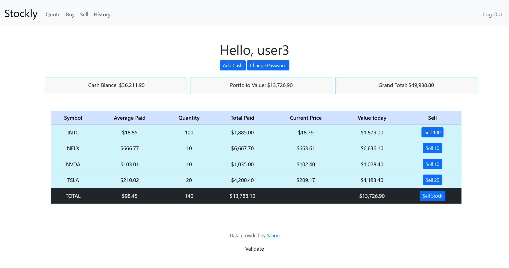
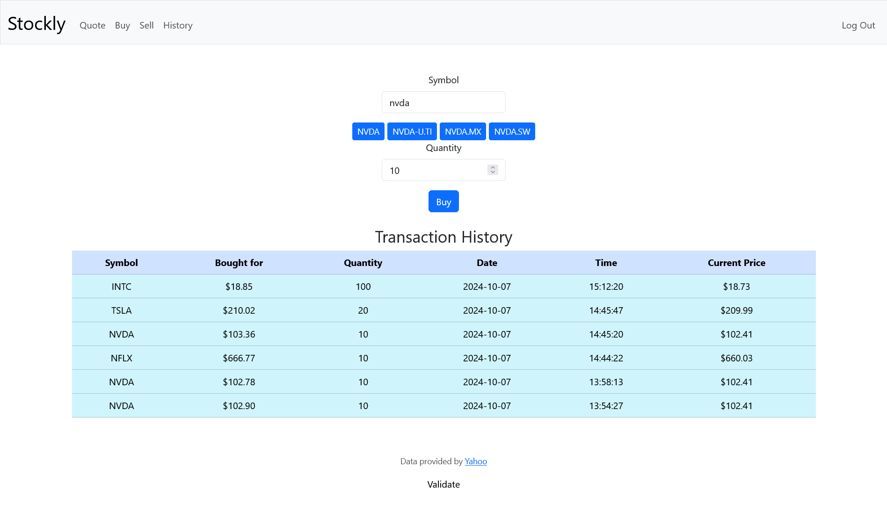
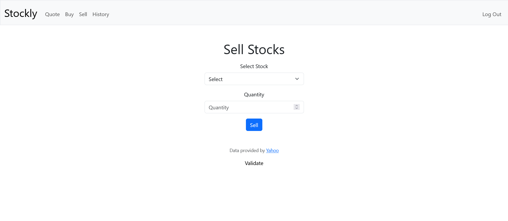
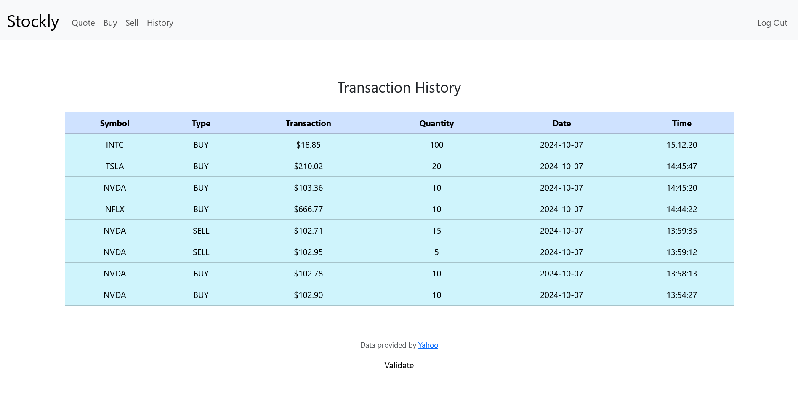

# Stockly

Stockly is a web application that allows users to manage their stock portfolios. Users can buy and sell stocks, view their portfolio, and track their transaction history.

## Features

- User registration and authentication
- Buy and sell stocks
- View portfolio with current stock prices
- Track transaction history
- Add cash to account

## Setup

1. Clone the repository:
    ```bash
    git clone https://github.com/leonti98/Stockly.git
    cd Stockly
    ```
2. Install dependencies:
    ```bash
    pip install -r requirements.txt
    ```
3. Run the application:
    ```bash
    flask run
    ```
4. Open the application in your browser at `http://localhost:5000`
5. Register an account and start trading!

## Technologies
- Python
- Flask
- SQLite
- Bootstrap
- Yahoo Finance API

## Screenshots
### Home Page

### Buy Page

### Sell Page

### History Page


PS: App was developed as part of CS50x course. And it's commit history is not available as it was developed in a private repository. You can check copy of all course projects [here](https://github.com/leonti98/CS50).